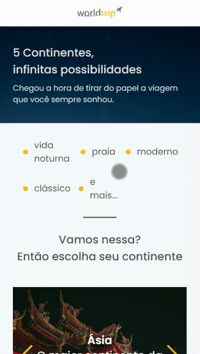

<h1 align="center">worldtrip  👋</h1>

<p align="center"><b>Status: Concluído ✔</b></p>

## 📄 Sobre

<p> 🚀 A aplicação consiste em um desafio complementar desenvolvido durante o módulo "Construindo interfaces do futuro" do Ignite, bootcamp ministrado pela [Rocketseat](https://rocketseat.com.br/). O desafio possui dois objetivos principais: desenvolver toda a interface usando como base o Chakra UI e trabalhar o responsivo da aplicação.</p>

## 🔝 Features

- [x] Header.
- [x] Banner.
- [x] CTA (call to action).

- Versão Web
  

- Versão Mobile
  

## 🛠 Tecnologias

As seguintes tecnologias foram utilizadas na construção deste projeto:

- [React](https://pt-br.reactjs.org/)
- [NextJS](https://nextjs.org/)
- [Typescript](https://www.typescriptlang.org/)
- [Chakra UI](https://chakra-ui.com/)
- [Swiper](https://swiperjs.com/react)
-

## 🚀 Como executar o projeto

### Pré-requisitos

Antes de começar, você vai precisar ter instalado em sua máquina as seguintes ferramentas:
[Git](https://git-scm.com), [Node.js](https://nodejs.org/en/).
Além disto é bom ter um editor para trabalhar com o código como [VSCode](https://code.visualstudio.com/)

### 🧭 Rodando a aplicação web

```bash
# Clone este repositório
$ git clone https://github.com/brunaschneiders/worldtrip.git

# Acesse a pasta do projeto no seu terminal/cmd
$ cd worldtrip

# Instale as dependências
$ yarn install

# Execute a aplicação em modo de desenvolvimento
$ yarn dev

# A aplicação será aberta na porta:3000 - acesse http://localhost:3000
```

## Autor

👤 **Bruna Schneiders**

- Github: [@brunaschneiders](https://github.com/brunaschneiders)
- LinkedIn: [@bruna-schneiders](https://linkedin.com/in/bruna-schneiders)
